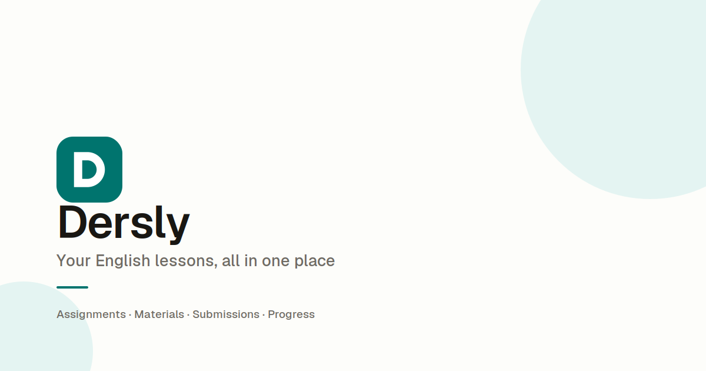

# Dersly

A teaching platform built for a real classroom. Dersly replaces sending homework over WhatsApp: students log in, read their homework and lesson notes, browse learning material, and check their English level.

**Live at [dersly.pro](https://dersly.pro)**



---

## Why this exists

I teach English in Baku. Private students online, a small course group, and a Sunday conversation club. Everything ran through WhatsApp: homework as photos, questions lost in scroll, no record of what was set when.

Dersly is the tool I built to fix that for my own students. It is in daily use, not a demo.

---

## What it does

### Teacher side

- **Classes:** create and manage classes of three kinds: one to one, course, and conversation. Each gets a six character invite code students use to join.
- **Homework:** write a guide in Markdown with a live preview and post it to a class. Previous homework stays.
- **Lesson tracking:** mark each private lesson as done, with an optional note for the student. Lessons count in packages of eight, with undo and a payment received reset.
- **Materials:** a shared library of guides, videos and reading links, tagged by level, visible to every student.
- **Students:** every enrolment across all classes, with level and schedule.
- **Overview:** which classes have current homework, and which private students have finished a package.

### Student side

- **Home:** next lesson with a join link, current homework, package progress, notes from recent lessons, recent materials.
- **Homework:** read the guide on a page built for reading. Tables turn into cards on a phone.
- **Materials:** filter by level, play videos inline, read guides.
- **Level test:** thirty CEFR questions, scored in the database, result saved to the profile and retakeable.
- **Profile:** level, classes, schedule, avatar, password change and account deletion.

---

## Stack

|           |                                             |
| --------- | ------------------------------------------- |
| Framework | Next.js 16, App Router                      |
| Language  | TypeScript                                  |
| Database  | Supabase (PostgreSQL)                       |
| Auth      | Supabase Auth, email and password           |
| Storage   | Supabase Storage, for avatars               |
| Content   | Markdown with react-markdown and remark-gfm |
| Styling   | Tailwind CSS v4, shadcn/ui                  |
| Forms     | react-hook-form, Zod                        |
| Email     | Resend over custom SMTP                     |
| Hosting   | Vercel                                      |

---

## Architecture

**Server first.** Reads happen in Server Components calling query functions directly. Mutations go through Server Actions. There are no route handlers except the auth callback, because nothing external consumes this data.

**Row level security is the security boundary.** Every table has policies. A student sees homework because they are enrolled in the class it belongs to, not because a query filtered it. The same query returns different rows depending on who runs it.

**Rules that span several rows live in Postgres.** Marking a lesson, scoring the level test and deleting an account are SQL functions. Each runs in one transaction, so a check and the write that depends on it cannot be separated. The Server Action validates input, calls the function and revalidates.

**The URL is the source of truth.** Pagination, filters, sorting and the active tab live in search params, validated by a shared Zod schema before reaching any query. No client state holds server data.

**Content is text, not files.** Homework and guides are stored as Markdown and rendered with components mapped to the design tokens, so they follow the theme and read well on a phone. A small rehype plugin labels each table cell with its column header, which lets tables stack into cards on narrow screens.

### Data model

Eight tables for the core app, four more for the level test.

```
profiles      extends auth.users, holds role and level
classes       a teaching unit, with an invite code
enrollments   joins students to classes, holds the package start date
lessons       one row per taught lesson, with an optional note
homework      Markdown guides, scoped to a class
materials     global library: guides, videos, reading links
submissions   reserved, not used yet
payment_receipts  reserved, not used yet

quizzes, questions, options, quiz_attempts
```

A private student is modelled as a class of one. `classes.type` changes how a class is presented, never how it is queried, so there is no branching logic anywhere underneath.

---

## Security

The database was audited in October 2026. What it enforces:

- **Two locks on every table.** Table grants first, then row level security. Visitors who are not signed in hold no table privileges at all.
- **Signup needs a valid class code.** The check runs in the signup trigger, so calling the Auth API directly cannot create an account without one.
- **Invite codes are never listed.** A visitor can only ask whether one code is valid, and gets back true or false.
- **Column level grants** cover what row level security cannot. A student can update their name, phone and avatar, but not their role or level. The level test's answer key is not readable by any app user.
- **Security definer functions** use an empty `search_path`, schema qualified names and explicit execute grants.

Schema changes are kept as SQL scripts in `supabase/sql/`.

---

## Decisions worth explaining

**Supabase Auth over Clerk.** Clerk would have saved a day of form building and cost a permanent sync layer between two sources of truth. With Supabase Auth, `profiles.id` is a foreign key to `auth.users` and `auth.uid()` works directly in RLS policies.

**Lesson marking is a SQL function, not a Server Action.** A package holds eight lessons. From a Server Action, checking the count and inserting the lesson are separate requests, so a double tap could record a ninth. Inside one function they share a transaction, and a row lock makes the second tap wait.

**The level test is scored in the database.** If the app scored it, the app would need to read the answer key, and so could any student with the same session. The function receives the chosen options, scores them and saves the attempt. The key never leaves Postgres.

**Markdown guides instead of PDFs.** PDFs opened on a storage URL outside the app and were hard to read on a phone. Guides render inside the app, follow the theme and always show the latest edit.

**No submissions.** Students hand work in during the lesson, so building an upload and grading flow would have been software nobody used. The table exists for a later version.

**No video calls.** Each class has a fixed meeting URL. Real time video is a separate product, not a feature.

**No practice quizzes.** Writing questions for every class, forever, is a content treadmill. The level test is written once and stays useful.

**Archive rather than delete classes.** Deleting cascades to homework and enrolments. `is_active` hides a class and keeps a year of work.

**Enrolment happens in a database trigger.** The invite code travels in signup metadata, and the trigger creates the profile and the enrolment in the same transaction. Doing it in the action fails, because `auth.uid()` is not yet set when the action runs.

---

## Running locally

```bash
git clone https://github.com/molamikedevs/dersly.git
cd dersly
pnpm install
```

Create `.env.local`:

```
NEXT_PUBLIC_SUPABASE_URL=
NEXT_PUBLIC_SUPABASE_PUBLISHABLE_KEY=
NEXT_PUBLIC_SITE_URL=http://localhost:3000
```

```bash
pnpm  dev
```

You will also need a Supabase project with the schema and RLS policies in place. Incremental scripts are in `supabase/sql/`.

---

## Roadmap

- Personal word list, so students save vocabulary from guides and review it
- Level test history, to show progress across attempts
- Classmates view, so group students can see who else is in their class
- Reminder emails when new homework is posted
- Multi teacher support, so the school can run its Russian and Azerbaijani classes on the same platform

---

## Author

**Lamin Kevin Foday**
[GitHub](https://github.com/molamikedevs) · [LinkedIn](https://linkedin.com/in/lamin-foday-23a263344)
